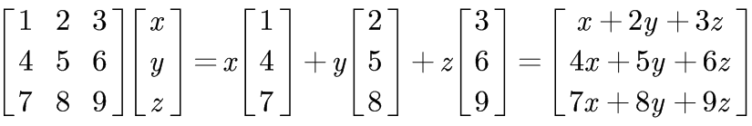
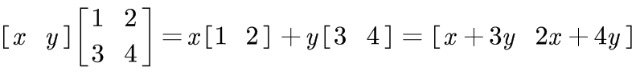
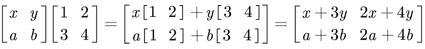

# 02-矩阵消元

## 1、Overview (概述)

本节首先介绍了消元法的初等变换实现，然后进一步介绍了向量与矩阵的乘法，在此基础上，研究了消元法的矩阵实现（消元矩阵）。最后简单地引入了置换矩阵与逆矩阵。

具体内容如下：

* Elimination（消元法）

* Back-Substitution （回代）

* Elimination Matrics（消元矩阵）

* Matrix Multiplication（矩阵乘法）

> 事实上，计算机语言实现方程的求解，就是通过 Elimination 实现的。

## 2、使用 消元法 求解方程：消元与回代

### 2.1、消元法介绍

消元法的使用场景主要分为以下 2 种情况: 
* 成功: 矩阵的主元不包含 0， 也就是说，是可逆矩阵。
* 失败: 矩阵的主元有至少一个 0，也就是说，是不可逆矩阵。

注：(1)这里的矩阵，一般指方程的系数矩阵;(2)消元法其实不止应用于系数矩阵为可逆矩阵的情形，也可以应用于不可逆的情形。（后续会讲到）

对于一些 “好” 的系数矩阵（可逆矩阵） A 来说，我们可以使用消元法来求解方程 <b>Ax=b</b> ，我们还是从一个例子谈起。

我们仍然使用矩阵计算，将方程写为矩阵形式 <b>Ax=b</b> 。如下: 

所谓矩阵的消元法，其实与我们在初等数学中学习的解二元一次方程组的消元法同理，都是通过将不同行的方程进行消元运算来简化方程，最后能得到简化的方程组。只不过这里我们把 <b>系数</b> 单独抽出来进行运算，寻找一种 <b>矩阵</b> 情况下的普遍规律而已。

注：消元法针对的其实是列向量，进行的操作却是初等行变换。

> 事实上，计算机使用消元法求解方程的时候，关键步骤就是求解从 A 到 U 的过程，然后通过算法不断优化这个过程，以提高方程求解的速度。

那么消元法何时失效呢？如果失效该如何处理呢？

事实上，并不是所有的 A 矩阵都可消元处理，需要注意在我们消元过程中，如果主元位置（左上角）为 0，
那么意味着这个主元不可取，需要进行 “换行” 处理：

首先看它的下一行对应位置是不是 0，如果不是，就将这两行位置互换，将非零数视为主元。
如果是，就再看下下行，以此类推。若其下面每一行都看到了，仍然没有非零数的话，那就意味着这个矩阵不可逆，
消元法求出的解不唯一。（后续我们会接着讨论这种解不唯一的情形，即系数矩阵不可逆的情形，这其实也是消元法的应用范围）

下面是 3 个例子: 

### 2.2、回带求解

其实回带求解应该和消元法同时进行，只不过在我们讲解的时候以及在一些软件工作原理中它们是先后进行的，所以我们这里分开讨论，下面我们首先介绍—— **增广矩阵**。

例如，

 

此方程的 **增广矩阵** 形式为: 

可以一下就看出来，**增广矩阵** 就是把 **系数矩阵 A** 和 **向量 b** 拼接成一个矩阵就行了。

从下向上开始求解，很容易求出 **x, y, z** 的值了。

## 3、消元法的矩阵视角：消元矩阵

### 3.1、向量相关的矩阵乘法： **矩阵行与列的线性组合** （虽然就简单，但这是个很重要的视角）

上面的消元法是从**初等行变换的角度**介绍了消元法的具体操作，接下来我们需要用矩阵来表示变换的步骤，这也十分有必要，因为这是一种 “系统地” 变换矩阵的方法。

导致错误。其实学过矩阵之间的乘法之后这些东西都极为简单，但这里还是建议大家尽量从向量的角度去考虑问题。

以下举例说明。

* 矩阵列向量的线性组合

  

* 矩阵行向量的线性组合

  例1：

  

  例2：

  

### 3.2、消元矩阵

学会了行向量与矩阵之间的乘法，我们就可以使用行向量对矩阵的行做操作了。

所谓 **消元矩阵，就是将消元过程中的初等行变换用矩阵乘法实现**。这其实就是从矩阵视角实现消元法，而不再是初等数学的方式了。

我们消元过程是将第一行 乘以 -3 加到 第二行，这是对第二行的操作，那么就从单位阵的第二行着手: 

### 3.3.1、置换矩阵初探：行变换和列变换

上面我们谈到了初等矩阵 E，事实上，还有一类初等矩阵：置换矩阵（Permutation matrix）,主要作用是交换2行或者2列。

### 3.3.2、逆矩阵初探

通过消元法，我们可以实现矩阵 A -> U, 那么我们考虑一个反过程，将消元法得到的 **矩阵 U**  变回到未经消元的 **矩阵 A** 。 那么如何实现呢？

答案就是 **乘上一个逆矩阵** ！！！。

## 4、小结

本节首先介绍了消元法的初等变换实现，然后进一步介绍了向量与矩阵的乘法，在此基础上，研究了消元法的矩阵实现（消元矩阵）。最后简单地引入了置换矩阵与逆矩阵。

具体内容如下：

* 初等数学的视角看待消元法求解方程
* 矩阵变换的视角看待消元法求解方程（将初等变换的过程通过矩阵（乘法）表示，EA = U）
* 向量与矩阵的乘法：矩阵行与列的线性组合
* 置换矩阵初探：矩阵的行变换与列变换
* 逆矩阵初探：如何从 U -> A

本章节的消元法以后会常用到，要熟练掌握才可以。

【[上一章：01-方程组的几何解释](../01-方程组的几何解释/01-方程组的几何解释.md)】【[下一章：03-乘法和逆矩阵](../03-乘法和逆矩阵/03-乘法和逆矩阵.md)】
