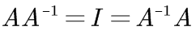
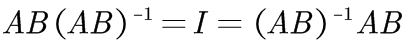
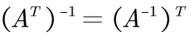
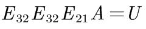
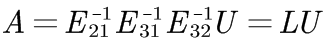

# 04-A 的 LU 分解

## 1、Overview（概述）

在上一篇 「03-乘法和逆矩阵」 中，我们在末尾介绍了 **逆矩阵** 的一些内容，今天我们首先完善之前讲到的 **逆矩阵** 的内容，然后使用 **消元矩阵** 介绍 A 的 LU 分解，即: 将矩阵 A 分解为 下三角矩阵 L 与上三角矩阵 U ，介绍这种运算的普遍规律。

最后我们再一次提起之前介绍过的 “行交换矩阵”，引入 **置换矩阵** 概念。

## 2、逆矩阵性质

我们考虑一个问题: 若方阵 A, B 都是可逆矩阵的话， AB 的逆矩阵是什么呢？

矩阵A存在逆矩阵，根据矩阵逆的定义：

要想求出方阵AB的逆，只需要找到满足矩阵满足以下式子：

显然，下式满足：

因此AB的逆为：

由于我们的下一章要涉及到矩阵的转置问题，我们在这里一并讨论矩阵转置与矩阵的逆的关系。

### 2.1、转置矩阵基础

转置矩阵就是将原矩阵各行换成对应列，所得到的新矩阵，如: 

看起来就像是沿着左上角开始的一条对角线翻折了一样。

注：单位阵的转置矩阵为单位阵。

### 2.2、转置矩阵和逆矩阵的关系

介绍完了转置矩阵，接下来我们看一看它和逆矩阵有什么联系？（我倒要看看你葫芦里卖的什么药）。

首先，逆矩阵满足：

为了找到转置矩阵与逆矩阵之间的关系。我们对上式两边同时进行转置运算，得到 

上式说明了，**矩阵A的转置的逆矩阵是A的逆矩阵的转置矩阵**。即：

上式说明对于方阵A，**转置运算和求逆运算的顺序可以颠倒。**

> 为什么  会变换到  的前面来呢？我们想象一下，最后乘积所得的单位矩阵 I 中每个元素都是由 A 的行向量与  的列向量构成，当做转置运算时，I 沿对角线翻折，可以理解为整个乘法运算图形也要沿着 I 的对角线进行翻折，这样就解释了上式。

## 3、A 的 LU 分解

在开始A的LU分解之前，先回顾一下消元法。对于方程 Ax = b，消元法的学习经过了以下几个过程：

* 初等数学的视角看待消元法求解方程
  * 消元：通过初等变换将 A 转换为 U
  * 回代：然后使用同样的初等变换过程将向量 b 转换为 c
  * 或者也可以统一起来：**[A | b] -> [U | c]**
* 矩阵变换的视角看待消元法求解方程
  * 矩阵视角看到消元法，本质上是将初等数学的方式用矩阵表示
  * A -> EA = U ，其中，E 为消元矩阵 

无论哪一种视角，消元法本质都是对系数矩阵 A 进行初等行变换（EA = U） ，只是表示方式不同而已。

* 下面我们介绍消元法的第三个视角，A = LU 分解的视角 （只是我这样看而已）

以二维矩阵 A 为例，若 A 可逆，则下式存在：

其中，  这样的矩阵一定有逆矩阵，因为它本身就是单位阵变化过来的。所以原式可以改写成: 

这一形式即为 A = LU 形式，这个过程就是分解过程。

接下来，我们讨论一下3*3矩阵的情况（假设没有行互换），则有：

因此：

**那么矩阵 L 是不是有什么特殊之处呢？**

我们通过下面一道例题来探讨一下。

从上面这个过程，我们可以看出，其实矩阵 L 是一个下三角矩阵（Lower），其下三角的系数刚好是初等行变换的主元位置的乘数。因此搞清楚如何进行初等行变换，就可以搞定 L 的求解，从而将 A 分解为 LU 的形式，其中，U为上三角矩阵(Upper)。

**那么消元法的运算量有多大呢**？

比如现在我们有一个 100*100 的超级大的矩阵(无 0 元素）。

我们需要运算多少次（将一行乘一定倍数后加到另一行上消元，每一个这样的过程计为 一次运算）之后，才能将其化为上三角矩阵 U 呢？

## 4、置换矩阵

**置换矩阵** 的定义：在数学上，特别是在矩阵理论中，置换矩阵是一个方形二进制矩阵，它在每行和每列中只有一个1，而在其他地方则为0。

我们之前接触过行变换所用到的矩阵，即是将单位阵 I 按照对应行变换方式进行操作之后得到的矩阵。它可以交换矩阵中的两行，代替矩阵行变换。什么时候 我们需要使用矩阵行变换呢？

一个经典的例子就是：在消元过程中，当矩阵主元位置上面不是 1 时，我们就需要用行变换将主元位置换回 1。

这样的由单位阵变换而来的矩阵，通过矩阵乘法可以使被乘矩阵行交换。

我们将这样的矩阵称为置换矩阵（Permutation, P）。我们通过一个例子来熟悉一下置换矩阵。

推广到 n 阶矩阵，n 阶矩阵有 n！个置换矩阵，就是将单位矩阵 I 各行重新排列后所有可能的情况数量。我自己的理解是：单看第一行，有 n 种排列方式， 再看除去第一行，第一列的(n-1)阶矩阵，再看其第一行，有(n-1)种排列方式。 以此类推，直到最后的 1 阶，有 1 种排列方式，由乘法原理，就有了 n!个置换 矩阵。

那么问题来了：置换矩阵的逆该如何求解呢？

事实上，置换矩阵的逆就在其「**置换矩阵群**」中。

## 5、小结

线性代数的前面这部分基本是一些技巧的运算。本节我们对矩阵的转置，逆矩阵性质进行了部分介绍，学习了矩阵的 A = LU 分解，了解了这种分解方式的优点所在，并学会了直接构造 L 矩阵，简化消元过程。**这些技巧与知识都是我们接下来学习的重要基础**。

总结一下，本节其实主要是对消元法的一个扩展，即 A 的 LU 分解。到此，消元法就全部结束了。主要有：

* 初等数学的视角看待消元法
* 矩阵变换的视角看待消元法
* 矩阵分解的视角看待消元法

其次，本节还在上一节求解单个矩阵 A 的逆的基础上，求解 AB 矩阵的逆。

然后，又引出了转置矩阵和置换矩阵两类矩阵。

【[上一章：03-乘法和逆矩阵](../03-乘法和逆矩阵/03-乘法和逆矩阵.md)】【[下一章：05-转置，置换，向量空间R](../05-转置-置换-向量空间R/05-转置-置换-向量空间R.md)】
