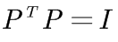
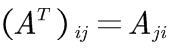
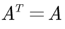
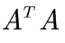

# 05-转置、置换、向量空间 R

## 1、Overview（概述）

在上一节 「04-A 的 LU 分解」中，我们谈到了 **置换矩阵** 和 **转置矩阵** ，这一节，我们再深入谈一下 **置换矩阵** 和 **转置矩阵** ，并简要介绍 **对称阵**。之后便进入学习 **linear-algebra （线性代数）** 的关键所在 —— **向量空间** 与 **子空间**，到此才算是开始进入线性代数的大门。

具体内容如下：

* 置换矩阵（Permutations）
* 转置矩阵（Transposes）
* 对称矩阵（Symmetric）
* 向量空间（Vector Spaces）及其子空间（Subspaces）

## 2、置换矩阵

> Permutations P: Identity matrix with reordered rows, which are used to execute row exchange.

**置换矩阵（Permutations, P） ** 是指对行进行重排的单位阵。主要用来进行行交换。

* 置换矩阵可以通过对单位阵的行进行重排得到，以下举个例子说明：

* 那么对于 n * n阶矩阵来说，有多少个置换矩阵呢？

答案是： n! 种，也就是将单位阵 I 各行重新排列后所有可能的情况的数量。

* 那么置换矩阵有什么性质呢？

所有的置换矩阵都满足：

因此，**所有的置换矩阵都是可逆矩阵**，其逆为其转置，即：

详细解释如下：

* 置换矩阵有什么用呢？

前面在讲消元法的时候，主元位置为 0 是一件很让人头疼的事情，这时就需要考虑 **置换矩阵 P**来完成行交换，确保消元过程顺利进行。

上一节我们学习 **A = LU** 分解时，我们没有考虑要交换行的过程，如果我们想写出更加普适的 LU 分解式的话，必须把 行交换 情况考虑进去，即: 

**PA = LU**

先用 行交换 使得主元位置不为 0，行顺序正确。其后，再用 LU 分解。

## 3、转置矩阵与对称矩阵

### 3.1、转置矩阵

**转置矩阵（Transposes）**：对于矩阵A，其转置矩阵满足：

示例如下：

### 3.2、对称阵

**对称矩阵（Symmetric Matrixs）**，顾名思义，就是对角线两侧元素对应相等的矩阵。

* 对称矩阵满足以下性质：

* 那么如何构造对称阵呢？

这里有个性质，对于任意矩阵 A, 矩阵 总是一个对称阵。

证明如下：

## 4、向量空间与子空间

### 4.1、向量空间

**向量空间（Vector Spaces） **表示一整个空间的向量。

但是要注意，不是任意向量的集合都能被称为 向量空间。

向量空间必须对以下运算满足封闭性，即两个向量进行以下运算得到的向量仍然属于这个向量空间。

* 向量加法：V + W
* 向量数乘：aV , 其中，a为标量。
* 向量的线性组合：aV + bW。其中，a，b为标量。事实上，以上2种运算都是线性组合的特例。

任何向量空间及其子空间都需要满足封闭性。

以下举例说明：

很明显，这部分空间无法满足 “线性组合仍在空间中” 的要求，比如 数乘运算 时，随便取个负数，向量就跑到第三象限去，脱离 D 空间范围内了。

### 4.2、子空间
上面的反例已经证明了。在向量空间里随便取其一部分，很可能得到的不是 向量空间。

那如果我们取向量空间的一部分，将其打乱，构成的有没有可能是 向量空间 呢？

---

总结一下，我们得到以下结论：

* 对于二维实向量空间（R2），其子空间有：
  * R2本身
  * 零向量构成的空间，记为Z
  * 所有经过原点（零向量）的直线，记为L
* 对于三维实向量空间（R3），其子空间有：
  * R3本身
  * 零向量构成的空间
  * 所有经过原点（零向量）的直线
  * 所有经过原点（零向量）的平面

### 4.3、列空间的简要介绍

那么如何构造子空间呢？

上面介绍的子空间都是基于已知的图像来寻找的，接下来我们来通过矩阵来构造出一个子空间。

比如: 列向量构造出的列空间。**对于矩阵A, 其所有列向量的线性组合构成了列空间，记为C(A)**。

这里还需要注意列向量之间的性质，如果列向量之间就是共线的，那么其列空间就是一条过原点的直线。

## 5、小结

本节算是结束了之前部分对基本运算和基本概念的介绍。介绍了 **向量空间** 和 **子空间**，并由子空间引出了**通过具体的列向量构成的空间 —— 列空间**。如何理解 **空间** 十分重要，本节中对低维的空间做了图，目的主要是便于我们理解 “**空间**” 这一概念。

【[上一章：04-A 的 LU 分解](../04-A的LU分解/04-A的LU分解.md)】【[下一章：06-列空间和零空间](../06-列空间和零空间/06-列空间和零空间.md)】
