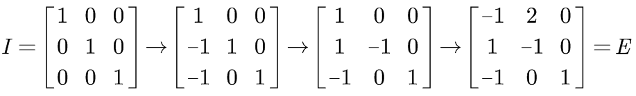

# 10-四个基本子空间

## 1、Overview（概述）
在前几节中，我们介绍过列空间，零空间。但是这还远远不够，对一个矩阵来说，我们能从它身上挖掘出来的空间不止这些，所以这一节我们介绍四个基本子空间，也是对空间概念的补充，更便于我们接下来的讨论。

具体内容如下：

给定 m*n 的矩阵 A，其转置矩阵为A'。研究矩阵 A 的以下几个子空间：

* 列空间 C(A)  Rm
* 零空间 N(A)  Rn
* 行空间 C(A') Rn
* 左零空间 N(A') Rm

接下来，将 Rn 空间扩展到 Rn * n 空间，研究：

* 矩阵空间：所有的 3*3 的矩阵构成的空间

## 2、四个基本子空间

### 2.1、四个基本子空间的维数与基

给定 m*n 的矩阵 A，其四个子空间的基本性质如下： 
* **列空间**

何为列空间？

> 列空间就是矩阵 A 的列向量的所有线性组合构成的空间。因为每个列向量都有 m 个分量，因此列空间是 Rm的子空间。

如何求解列空间的基呢？

> 对矩阵 A 进行初等行变换 (rows reduction)，通过消元法化简 A 得到矩阵 U，即可确认矩阵 A 的主列，这些主列列就是 C(A) 的一组基。

那么列空间的维数是多少呢？

> 设矩阵 A 的秩为 r ，则 A 有 r 个主列，这 r 个主列就是列空间 C(A) 一组基，一组基里有 r 个向量，所以列空间维数为 r 。

* **零空间**

何为零空间？

> 零空间就是方程 Ax = 0 的所有特解线性组合构成的空间。因为每个特解都有 n 个分量，因此零空间是 Rn的子空间。

如何求解零空间的基呢？

> 对矩阵 A 进行初等行变换 (rows reduction)，通过消元法化简 A 得到矩阵 U，即可确认矩阵 A 的自由列，从而确认矩阵 A 的自由变量，通过对自由变量赋值（0 或者 1），即可得到零空间的基向量，这些基向量就构成了零空间 N(A) 的一组基。

那么零空间的维数是多少呢？

> 设矩阵 A 的秩为 r ，则 A 的自由列为 n-r 列。这 n-r 列决定了 x 中的 n-r 个自由变量，赋值后就构成了零空间的 n-r 个基向量，这n-r个基向量构成了零空间的基，故零空间维数为 n-r。

* **行空间**

何为行空间？

> 行空间就是矩阵 A 的行向量的所有线性组合构成的空间。因为每个行向量都有 n 个分量，因此行空间是 Rn的子空间。

如何求解行空间的基呢？

> 方法1：将矩阵 A 转置，然后按照列空间的基的求法求解 A 的转置矩阵的列空间。
>
> 方法2：对矩阵 A 进行初等行变换 (rows reduction)，通过消元法化简 A 得到矩阵 A 的行最简形（reduced row echelon form）R，若矩阵 A 的秩为 r, 则矩阵 A 的行空间的基就是矩阵 R 的前 r 个向量。 
>
> 注意：初等行变换会改变矩阵的列空间，但是不会改变矩阵的行空间。

以下举例说明：

那么行空间的维数是多少呢？

> 设矩阵 A 的秩为 r ，则根据以上分析可以知道，行空间维数为 r 。

* **左零空间**

何为左零空间？

> 左零空间就是矩阵 A 的转置构成的方程组 A'y = 0 的特解的所有的线性组合构成的空间。因为每个特解都有 m 个分量，因此零空间是 Rm的子空间。
>
> 左零空间本质上是矩阵 A 行向量线性组合的系数构成的向量线性组合构成的空间。即 y' A = 0 的特解的所有线性组合构成的空间。

如何求解左零空间的基呢？

> Gauss-Jordan 消元法
>
> [A | I]  -> [I | A-1]
>
> [A | I] -> [R | E]
>
> 找到矩阵中，使得方程 EA = 0 那些行就是左零空间的基。

以下通过示例具体介绍。

首先介绍一下左零空间，写成方程形式为  ，我们不处理  ，所以将

注：Gauss-Jordan 消元的具体过程如下：

那么左零空间的维数是多少呢？

> 设矩阵 A 的秩为 r ，则根据以上分析可以知道，左零空间维数为 m-r 。

### 2.2、四个基础空间图像

## 3、矩阵空间初探：新的向量空间

事实上，向量空间的元素并不一定都是由实数组成的向量，也可以是实数组成的 3 * 3 的矩阵。

矩阵空间：矩阵构成的空间。例如所有的 3*3 矩阵构成的空间。

那么矩阵空间是否满足空间要求的封闭性呢？

> 给定 3*3 矩阵 A, B, 常数 c
>
> * 加法封闭性：A + B 仍然是 3 * 3 矩阵
> * 数乘封闭性：cA 仍然是 3 * 3 矩阵
>
> 因此，矩阵空间满足空间所要求的封闭性。

因此，所有的 3 * 3 矩阵构成了一个线性空间，那么它的子空间有什么呢？

> 上三角矩阵，对称矩阵，对角矩阵，这些矩阵都是其子空间。

很明显，上三角矩阵与对称矩阵的交集为对角矩阵(diag)。深入研究对角矩阵，就要给出它的基，

注：矩阵空间是空间从Rn 到 Rn*n的扩展。

## 4、小结

这一节课基本是概念的介绍，介绍了四个基本空间，其中比较新的内容是左零空间，即行向量的线性组合得到零，这部分要好好理解。前面重点在于 2.2 的图，在我们以后的应用中会经常用到。另外还稍微说到了一下向量空间的概念，为我们下一节的内容埋下了一个小伏笔。

【[上一章：09-线性相关性、基、维数](../09-线性相关性-基-维数/09-线性相关性-基-维数.md)】【[下一章：11-矩阵空间、秩1矩阵和小世界图](../11-矩阵空间-秩1矩阵和小世界图/11-矩阵空间-秩1矩阵和小世界图.md)】
