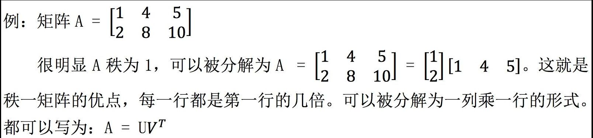

# 11-矩阵空间-秩1矩阵和小世界图

## 1、Overview（概述）

上节末尾我们介绍了矩阵空间，这是一种延伸的向量空间。这节我们从矩阵空间谈起，介绍矩阵空间的维数，基等问题。渗透一些微分方程与线性代数之间的联系，并介绍秩为 1 的矩阵特点。

具体内容如下：

* 矩阵空间深入（新的向量空间）
* 秩1矩阵与空间
* 小世界图初探（Small world graphs）

## 2、矩阵空间深入

还是上一节中的问题，将所有的 3 * 3 的矩阵都看做 “向量空间” 中的元素，很明显，由所有 3 * 3 矩阵构成的集合中，矩阵之间加法与数乘矩阵都是封闭的，所以所有 3 * 3 矩阵构成的集合 M 是矩阵空间（一种新的向量空间）。

上节中我们介绍过，M 有两个基本的子空间：
* 子空间S：3*3 对称矩阵构成的子空间
* 子空间U:  3*3 上三角矩阵构成的子空间

 S 与 U 空间相交，可以得到M的另一个子空间D：由3*3对角阵构成的子空间。

### 2.1、矩阵空间的基与维数

讨论一个向量空间，需要搞清楚空间的基与维数。

以下讨论矩阵空间 M 、子空间 S、U、D以及空间 S+U 的基与维数。

* 矩阵空间 M 类似于实数向量空间 R9，只是 M 的元素为 `3*3` 矩阵，而 R9 的元素为 `9*1` 向量，故二者的基与维数也很类似。
* M = S + U

### 2.2、微分方程与线性代数的关系

## 3、秩一矩阵

### 3.1、秩一矩阵

秩一矩阵是指秩为1的矩阵。秩一矩阵具有以下优点：

* 可以分解为`列向量 * 行向量`的形式。
* 可以像搭积木一样构建出其他矩阵。

以下举例说明。

秩一矩阵的另外一个优点是它可以 “构建” 其他矩阵，比如秩为 4 的矩阵， 通过四个秩一矩阵就能搭建出来。具体过程类似于矩阵乘法中的“列乘行”形式， 通过一列一行搭出一个矩阵。

### 3.2、几个问题  

#### 3.2.1 问题1：同秩矩阵是否可以构成空间？

#### 3.2.2 问题2：子空间的转化

下面我们通过这样一个例子再加深一下对子空间的印象：

因此维度为 **n-r=3** ， S 的零空间是三维空间。其基为 Av=0 的三个特解。

因此列空间的维度为1，左零空间的维度为0。

再看看A 的行空间C(A')。A 的行空间为 A 的行向量的所有线性组合，其维度为1。

## 4、小世界图初探：图论与线性代数的关系

这一小节内容是对下一节 “图与网络” 的引出，主要讨论图论与线性代数的关系。

**图** 是节点与边的集合，即 Graph={nodes, edges}。如图所示：

这个图包括五个节点和六条边，可以用一个 5*6 的矩阵来表示其中的所有信息。具体内容我们下节课再说。

所谓的**“六度分割理论”**就可以通过图来描述。

## 5、小结

这一节中主要介绍了线性空间，一并介绍了类似于矩阵空间，解空间这一类空间的存在。另外，秩一矩阵将我们之前学习的矩阵乘法列乘行方式联系了起来，便于分解，可以搭建矩阵。

【[上一章：10-四个基本子空间](../10-四个基本子空间/10-四个基本子空间.md)】【[下一章：12-图和网络](../12-图和网络/12-图和网络.md)】
