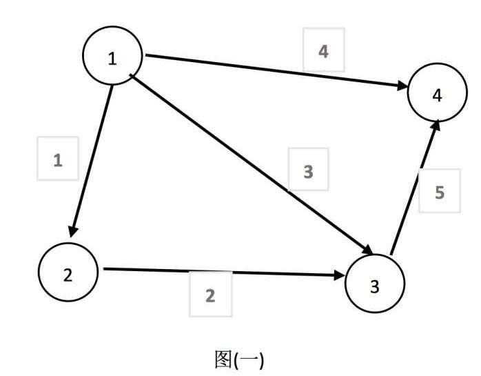
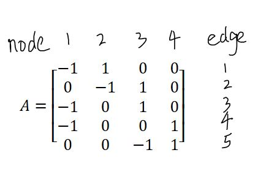
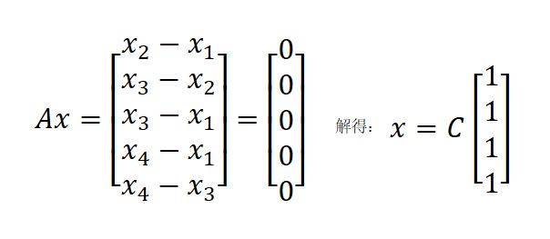
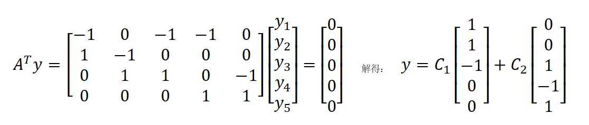
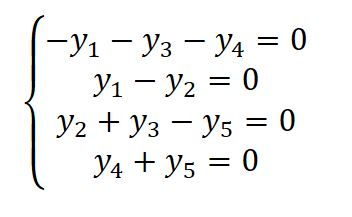
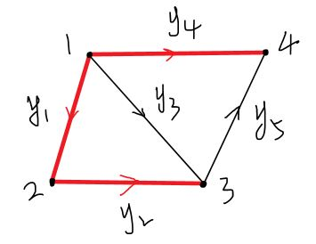
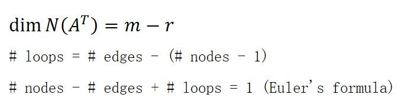

# 12-图和网络

## 1、Overview（概述）

这一节中我们主要介绍图与矩阵之间的关联，利用矩阵来说明图的特点。这一节中与之前几节的区别主要在于，前面例子中的矩阵中的元素大都是为了说明性质编造出来的，而本节中矩阵中的元素都是来源于实际问题，更能体现出我们之前介绍的性质在实际问题中有什么用。

本节主要以电路定律为例，介绍线性代数的应用。具体内容如下：

* 图的深入：图和关联矩阵
* 电路定律：欧姆定律、基尔霍夫定律与平衡方程

## 2、图和关联矩阵

线性代数在互联网、电路、信号系统、微积分等方面有着广泛的应用。本小节以电路网络为例讨论线性代数的实际应用。

在研究实际问题的过程中，我们首先需要将实际问题抽象成数学模型，然后用数学手段处理数学模型。在处理与图有关的实际问题的时候，首先需要将图抽象为关联矩阵。**由于关联矩阵源于实际问题，因此关联矩阵有效地描述了实际问题的拓扑结构。**

接下来，我们主要研究利用线性代数处理与图相关的实际问题。

### 2.1 关联矩阵的建立

图是由节点(nodes)和边(edges)组成的。图1是一个有向图，有4个节点，5条边。

接下来，我们需要将此有向图抽象为一个关联矩阵。关联矩阵的每列表示一个节点，每行表示一条边，边的起点记为-1，边的终点记为1。因此此图的关联矩阵为：

如果我们仔细观察矩阵 A 的话，会发现1 2 3行满足：行1+行2=行3，因此3行线性相关。回到图中发现，行1,2,3对应的边构成了一个回路，因此若图中的边构成回路的话，那么其对应的矩阵的行线性相关。

接下来，我们详细讨论一下矩阵A的特点。

### 2.2 关联矩阵的研究

* 零空间

研究矩阵A的特点，很重要的一个方面就是A的零空间N(A)。接下来我们在电路系统的实际背景下，研究A的零空间。

假设列向量 x = [x1, x2, x3, x4]' 为每个节点的电势。

零空间主要研究的问题是：如何对列向量进行线性组合可以得到零向量？ 要研究A的零空间，本质上是研究A的各列的线性无关性。若线性无关，则N(A) = {O}，即零空间只包含一个零向量，此时零空间的维度为0。

零空间是 Ax = 0 的解的线性组合，因此我们构造方程Ax = 0，求解矩阵 A 的零空间。

我们试着猜一下，发现当x = O 或者是 x = [1 1 1 1]‘ 时，Ax = 0。

通过求解，得到矩阵 A 的零空间为：c[1 1 1 1]‘，其基  x = [1 1 1 1]‘，其维度 dim N(A) = 1，其秩 rank = 4 - 1 = 3。 A 的零空间的形式说明了节点的电势由一个常数决定，c 决定了节点电势的上升或者下降。rank = 3  说明了任意3个节点的电势线性无关。只有电路中各节点之间存在电势差时，才能产生电流，因此，当每个节点的电势相同时，电路是无法产生电流的。

* 左零空间

接下来我们再研究一下矩阵 A 的左零空间。要找到A的左零空间，需要求解方程 A'y = 0。 

因此，A的左零空间为所求解，其基为[1 1 -1 0 0]’ 和[0 0 1 -1 1]‘，其维度为 dim = m - r = 5 - 3 = 2。

我们仔细看一下， A'y = 0 这一个式子代表什么含义。A'y = 0 展开为：

这个式子表示的图如下图所示。我们会发现每个式子都表示给定任意一个节点，其流入的电流等于流出的电流，说明节点不会积累电荷，电荷在整个电路中循环移动，这个定律就是**基尔霍夫定律**（KCL）。另外，我们发现 A 的转置矩阵的主列为1，2，4列，这三列线性无关，从图中可以看出这3列对应的边（红色标记的边）没有构成回路。因此没有构成回路的边在矩阵中构成的向量线性无关。

* 边、节点、回路的关系

### 2.3 线性代数与电路系统

将以上内容总结如下：

## 3、小结

可以看到，这一节与我们之前讲的内容联系较多，与实际应用联系也比较大。从一个图出发，联系实际物理问题，解释了如何用矩阵阐述欧姆定律以及基尔霍夫定律的。学习了我们本节的内容之后，我们才算真正明白了之前学习的各种空间具体到实际问题有什么作用。

【[上一章：11-矩阵空间、秩1矩阵和小世界图](../11-矩阵空间-秩1矩阵和小世界图/11-矩阵空间-秩1矩阵和小世界图.md)】【[下一章：13-复习一](../13-复习一/13-复习一.md)】
